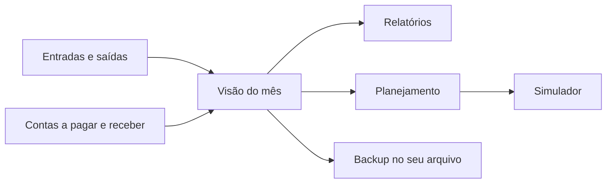
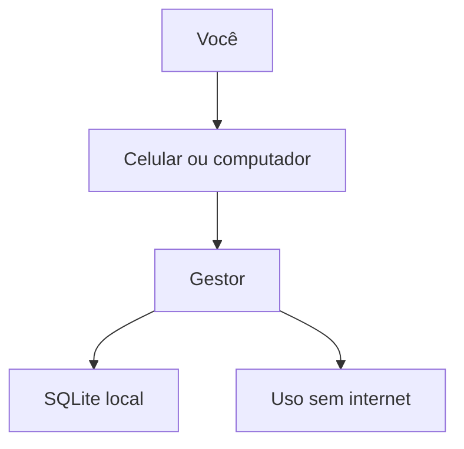

# Gestor

**Seu dinheiro, com clareza.** Um aplicativo de finanças pessoais em português para quem quer organizar o mês sem entregar os dados a um banco ou a uma planilha na nuvem.

[Abrir o produto](https://gestor-opal.vercel.app) · [O que é](docs/produto.md) · [Como usar](docs/uso.md) · [Celular](docs/celular.md)


<p align="center">
  
  
  
  
</p>

## Por que existe

A maior parte das pessoas acompanha o dinheiro em extrato, WhatsApp e caderno. O Gestor junta isso num só lugar: o que já entrou, o que já saiu, o que ainda vai vencer e o que você quer conquistar.

Os registros ficam **neste aparelho**, em SQLite. Sem mensalidade, sem anúncio e sem conta na nuvem.

## O que você resolve

| No dia a dia | No planejamento |
| --- | --- |
| Ver o resultado do mês | Limite de despesas e meta de receitas |
| Lançar receitas e despesas | Objetivos de reserva |
| Dar baixa em contas previstas | Destino do dinheiro por categoria |
| Exportar CSV do período | Simular dívida e projetar receitas |


## Como o produto se encaixa





## Começar em 2 minutos

```sh
npm start
```

Abra `http://127.0.0.1:8080`. Node.js 18 ou superior. Não é necessário `npm install`.

Na [versão publicada](https://gestor-opal.vercel.app), use **Conhecer com dados de exemplo** para uma demonstração descartável.

No celular: Chrome (Android) ou Safari (iPhone) → instalar na tela inicial. Guia: [docs/celular.md](docs/celular.md).

## Documentação

| Documento | Conteúdo |
| --- | --- |
| [Produto](docs/produto.md) | Promessa, público e diferenciais |
| [Como usar](docs/uso.md) | Rotina do mês, parcelas e backup |
| [Celular](docs/celular.md) | Android, iPhone e APK |
| [Arquitetura](docs/arquitetura.md) | Camadas, dados e publicação |
| [Desenvolvimento](docs/desenvolvimento.md) | Comandos, pastas e testes |

## Autoria

[DaviiAlvess](https://github.com/DaviiAlvess) — DAVI ALMEIDA DOS SANTOS ALVES. Licença [MIT](LICENSE).
