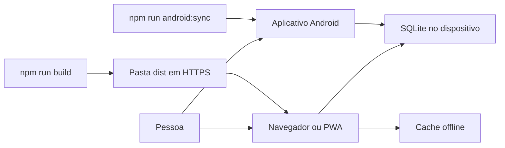
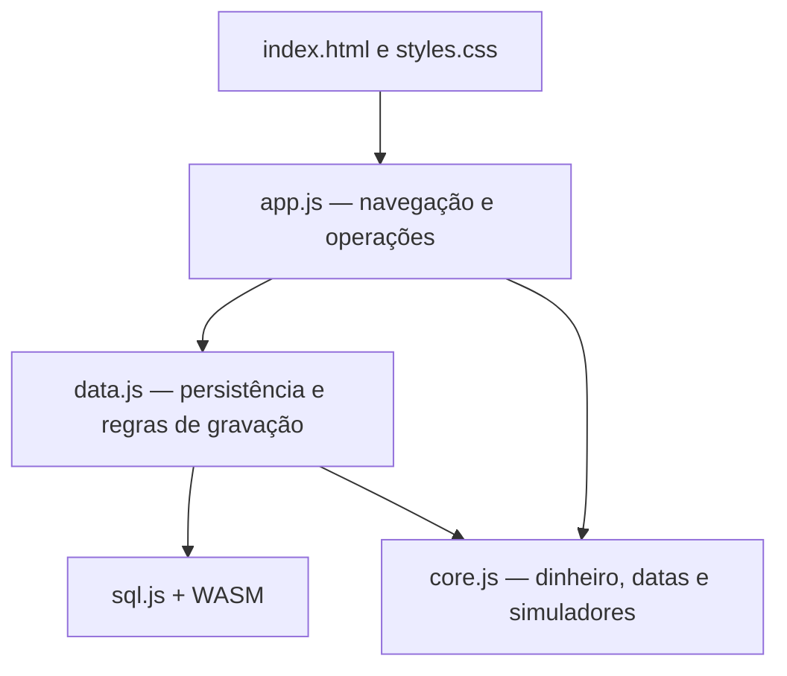
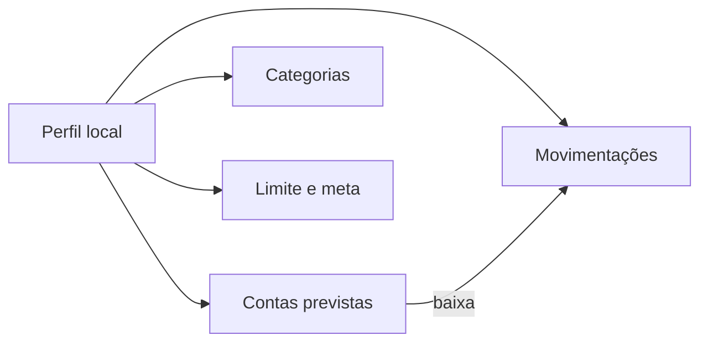

# Arquitetura

O Gestor é um aplicativo web estático com persistência local. Não há API remota de finanças.

## Visão do sistema

## Camadas

| Arquivo | Responsabilidade |
| --- | --- |
| `app/index.html` | Estrutura das telas e formulários |
| `app/styles.css` | Identidade visual e adaptação a celular |
| `app/app.js` | Sessão, views, backup, CSV e diálogos |
| `app/data.js` | SQLite, perfis, parcelas e contas previstas |
| `app/core.js` | Cálculos sem dependências de interface |
| `app/pwa.js` e `app/sw.js` | Instalação e uso offline |
| `android/` | WebView que empacota o mesmo aplicativo |
| `server.cjs` | Servidor local de desenvolvimento |

## Dados

O banco fica na chave `db` do armazenamento local, na origem atual (protocolo, endereço e porta). Senhas novas usam PBKDF2/SHA-256. O backup exporta o SQLite completo; restaurar substitui o que está no dispositivo.

## Publicação

`npm run build` copia `app/` para `dist/` e versiona o cache offline. A hospedagem deve servir `dist` em HTTPS. O endereço `127.0.0.1` não instala no celular.
